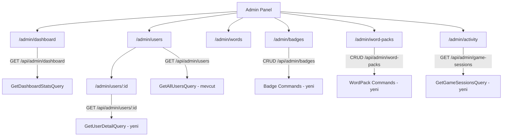

# Admin Panel Yeni Özellikler - Geliştirme Planı

## Mevcut Durum

Şu anda admin panelinde yalnızca 2 sayfa var:

- `/admin/users` - Kullanıcı listesi + aktif/pasif toggle
- `/admin/words` - Kelime CRUD

Mevcut dosyalar:

- [frontend/src/app/admin/](tabu-ai/frontend/src/app/admin/) - Admin frontend
- [backend/src/TabuAI.API/Controllers/AdminController.cs](tabu-ai/backend/src/TabuAI.API/Controllers/AdminController.cs) - Admin API
- [backend/src/TabuAI.Infrastructure/Data/TabuAIDbContext.cs](tabu-ai/backend/src/TabuAI.Infrastructure/Data/TabuAIDbContext.cs) - Tüm entity'ler mevcut

---

## Eklenecek Özellikler

### 1. Admin Dashboard (Öncelik: Yüksek)

**Amaç:** Sistemin genel durumunu tek bakışta görmek.

**Backend - Yeni endpoint:** `GET /api/admin/dashboard`

- Dosya: `GetDashboardStatsQuery.cs` + Handler
- Döndürülecek veriler:
  - Toplam kullanıcı sayısı, aktif/pasif breakdown
  - Toplam oyun sayısı (GameSession)
  - Toplam kelime sayısı (aktif/pasif)
  - Bugün oynanan oyun sayısı
  - Son 7 günlük yeni kayıt grafiği
  - En aktif 5 kullanıcı

**Frontend:**

- `admin/pages/admin-dashboard/` yeni component
- Rota: `/admin/dashboard` (default redirect buraya)
- Stat kartları + basit liste

---

### 2. Kullanıcı Detay Sayfası (Öncelik: Yüksek)

**Amaç:** Bir kullanıcının tüm bilgilerini, istatistiklerini ve geçmişini görmek.

**Backend - Yeni endpoint:** `GET /api/admin/users/{userId}`

- Dosya: `GetUserDetailQuery.cs` + Handler
- Döndürülecek veriler: User bilgileri, UserStatistic, son 10 GameSession, rozet listesi, CoinTransaction geçmişi

**Frontend:**

- `admin/pages/user-detail/` yeni component
- Rota: `/admin/users/:id`
- Mevcut user-management listesindeki satırlara "Detay" butonu eklenir

---

### 3. Badge (Rozet) Yönetimi (Öncelik: Orta)

**Amaç:** Sistemdeki rozetleri yönetmek (oluştur, düzenle, sil, hangi kullanıcılara verildiğini gör).

**Backend - Yeni endpoint'ler:**

- `GET /api/admin/badges` - Tüm rozetler
- `POST /api/admin/badges` - Yeni rozet
- `PUT /api/admin/badges/{id}` - Rozet güncelle
- `DELETE /api/admin/badges/{id}` - Rozet sil
- `POST /api/admin/badges/{badgeId}/assign/{userId}` - Kullanıcıya manuel rozet ver

Dosyalar: `GetAllBadgesQuery`, `CreateBadgeCommand`, `UpdateBadgeCommand`, `DeleteBadgeCommand`, `AssignBadgeCommand`

**Frontend:**

- `admin/components/badge-management/` yeni component
- Rota: `/admin/badges`
- Tablo + modal (word-management ile aynı pattern)

---

### 4. WordPack Yönetimi (Öncelik: Orta)

**Amaç:** Kelime paketlerini yönetmek; paket oluştur, pakete kelime ata.

**Backend - Yeni endpoint'ler:**

- `GET /api/admin/word-packs` - Tüm paketler
- `POST /api/admin/word-packs` - Yeni paket
- `PUT /api/admin/word-packs/{id}` - Paket güncelle
- `DELETE /api/admin/word-packs/{id}` - Paket sil
- Mevcut `AddWordCommand`'a `wordPackId` parametresi zaten var

Dosyalar: `GetAllWordPacksQuery`, `CreateWordPackCommand`, `UpdateWordPackCommand`, `DeleteWordPackCommand`

**Frontend:**

- `admin/components/word-pack-management/` yeni component
- Rota: `/admin/word-packs`
- Kelime yönetiminde pakete göre filtre dropdown'u eklenir

---

### 5. Oyun & Aktivite İzleme (Öncelik: Düşük)

**Amaç:** Son oyunları, aktivite loglarını ve sistem olaylarını izlemek.

**Backend - Yeni endpoint'ler:**

- `GET /api/admin/game-sessions?page=1&limit=50` - Son oyunlar (sayfalı)
- `GET /api/admin/activity-logs?page=1&limit=100` - Aktivite logları

Dosyalar: `GetGameSessionsQuery`, `GetActivityLogsQuery`

**Frontend:**

- `admin/pages/activity/` yeni component
- Rota: `/admin/activity`
- Sayfalı tablo görünümü

---

## Mimari Akış

---

## Uygulama Sırası

1. **Admin Dashboard** - En görünür etki, hızlı implement
2. **Kullanıcı Detay Sayfası** - Mevcut user listesini tamamlar
3. **Badge Yönetimi** - Entity hazır, sadece UI + API gerekli
4. **WordPack Yönetimi** - Word management ile entegre
5. **Aktivite İzleme** - En az kritik, son yapılır

---

## Sidebar Güncellemesi

`admin-layout.component.ts` dosyasına yeni menü öğeleri eklenecek:

- Dashboard
- Kullanıcılar (mevcut)
- Kelimeler (mevcut)
- Kelime Paketleri (yeni)
- Rozetler (yeni)
- Aktivite (yeni)

